# 💳 NFC-SuiPay: Decentralized NFC & QR Payment Platform

[](https://opensource.org/licenses/MIT)
[](https://sui.io/)
[](https://www.typescriptlang.org/)
[](https://nextjs.org/)

## 📋 Table of Contents

- [Overview](#overview)
- [System Architecture](#system-architecture)
- [User Roles & Features](#user-roles--features)
- [Payment Methods](#payment-methods)
- [Technology Stack](#technology-stack)
- [Smart Contracts](#smart-contracts)
- [Installation & Setup](#installation--setup)
- [API Documentation](#api-documentation)
- [Usage Guide](#usage-guide)
- [Deployment](#deployment)
- [Contributing](#contributing)
- [License](#license)

## 🎯 Overview

NFC-SuiPay is a comprehensive **decentralized payment platform** built on the Sui blockchain, enabling secure and fast payments through:

- **💳 NFC Card Payments** - Tap-to-pay with physical NFC cards
- **📱 QR Code Payments** - Scan-to-pay with QR codes
- **🔄 Token Swapping** - Real-time USD/VND token exchange
- **👥 Multi-role System** - User, Merchant, and Admin interfaces
- **🔐 Secure Authentication** - PIN, biometric, and signature verification
- **📊 Real-time Analytics** - Comprehensive transaction monitoring

## 🏗️ System Architecture

### **High-Level Architecture**


### **User Role Architecture**

```mermaid
graph LR
    subgraph "User Roles"
        A[👤 Regular User]
        B[🏪 Merchant]
        C[👑 Admin]
    end
    
    subgraph "User Features"
        D[NFC Card Management]
        E[QR Payment Scanning]
        F[Wallet Management]
        G[Transaction History]
    end
    
    subgraph "Merchant Features"
        H[POS Terminal]
        I[QR Code Generation]
        J[Payment Analytics]
        K[Transaction Reports]
    end
    
    subgraph "Admin Features"
        L[User Management]
        M[System Monitoring]
        N[Transaction Oversight]
        O[System Configuration]
    end
    
    A --> D
    A --> E
    A --> F
    A --> G
    
    B --> H
    B --> I
    B --> J
    B --> K
    
    C --> L
    C --> M
    C --> N
    C --> O
```


## 👥 User Roles & Features

### 👤 **Regular User**
- **NFC Card Management**: Register, activate, and manage physical NFC cards
- **QR Payment Scanning**: Scan QR codes to make payments
- **Wallet Integration**: Connect Sui wallet for token management
- **Transaction History**: View all payment and transaction records
- **PIN/Biometric Setup**: Configure secure authentication methods
- **Token Swapping**: Exchange USD/VND tokens with real-time rates

### 🏪 **Merchant**
- **POS Terminal Interface**: Complete point-of-sale system
- **QR Code Generation**: Create payment requests with QR codes
- **NFC Payment Processing**: Accept tap-to-pay transactions
- **Payment Analytics**: Revenue tracking and transaction analytics
- **Transaction Reports**: Detailed financial reports and exports
- **Customer Management**: Track customer payment patterns
- **Real-time Notifications**: Instant payment confirmations

### 👑 **Admin**
- **User Management**: Create, modify, and manage user accounts
- **Merchant Onboarding**: Approve and manage merchant registrations
- **System Monitoring**: Real-time system health and performance monitoring
- **Transaction Oversight**: Monitor all platform transactions
- **Security Management**: Configure security policies and limits
- **Analytics Dashboard**: Platform-wide analytics and insights
- **System Configuration**: Manage system settings and parameters

## 💳 Payment Methods

### **NFC Card Payments**


### **QR Code Payments**


### **Authentication Methods**
- **PIN Verification**: 4-6 digit PIN for quick authentication
- **Biometric Authentication**: Fingerprint and face recognition
- **Digital Signature**: Cryptographic signature verification
- **Multi-factor Authentication**: Combined security methods

## 🔄 Payment Flow Diagrams

### **Complete Payment Ecosystem**


### **User Registration & Onboarding Flow**


## 🛠️ Technology Stack

### **Frontend**
- **Framework**: Next.js 15.5.0 with React 19.1.0
- **Language**: TypeScript 5.x
- **UI Library**: Shadcn UI with Radix UI primitives
- **Styling**: Tailwind CSS 4.x
- **Blockchain**: Sui DApp Kit 0.18.0, Sui SDK 1.37.4
- **State Management**: React Hooks, TanStack Query
- **NFC Support**: Web NFC API for card reading

### **Backend**
- **Runtime**: Node.js with Express.js
- **Language**: TypeScript 5.x
- **Database**: MongoDB with Mongoose
- **Cache**: Redis with IORedis
- **Queue**: Bull Queue for background jobs
- **Blockchain**: Sui SDK for smart contract interaction
- **Authentication**: JWT with refresh tokens
- **Real-time**: WebSocket for live updates

### **Smart Contracts**
- **Language**: Move
- **Platform**: Sui Testnet
- **Features**: Token minting, oracle system, swap pools
- **Decimals**: 9 decimal places for precision
- **Security**: Input validation and access control

### **External Services**
- **Oracle APIs**: CoinGecko, ExchangeRate-API, Fixer.io, Alpha Vantage
- **Infrastructure**: Docker, PM2 for process management
- **Monitoring**: Winston logging, Morgan request logging
- **Security**: Helmet.js, rate limiting, CORS

## ⛓️ Smart Contracts

### **Token Contracts**

#### USD Token (`sUSD.move`)
```move
module swap::USD {
    // 9 decimal places for precision
    // TreasuryCap for minting control
    // Metadata with icon and description
}
```

#### VND Token (`vietnamdong.move`)
```move
module swap::VND {
    // Vietnamese Dong token
    // 9 decimal places matching USD
    // Compatible with swap operations
}
```

### **Oracle System (`price_oracle.move`)**
```move
module swap::custom_oracle {
    public struct Price {
        id: UID,
        value: u64,    // USD/VND rate
        timestamp: u64
    }
    
    // Real-time price updates from backend
    // Immutable price history
    // Gas-efficient price queries
}
```

### **Swap Pool (`swap.move`)**
```move
module swap::swap {
    public struct Pool {
        id: UID,
        test_VND: Balance<VND>,
        test_USD: Balance<USD>
    }
    
    // Automated Market Maker (AMM) logic
    // Oracle-based pricing
    // Liquidity management
}
```

## 🚀 Installation & Setup

### **Prerequisites**
- Node.js 18+ and npm/pnpm
- Sui CLI installed
- MongoDB instance
- Redis instance
- Git

### **1. Clone Repository**
```bash
git clone https://github.com/nhatlapross/NFC-suipay.git
cd NFC-suipay
```

### **2. Smart Contract Setup**
```bash
cd swap
sui client new-address ed25519
sui client faucet
sui move build
sui move test
sui client publish --gas-budget 100000000
```

### **3. Backend Setup**
```bash
cd backend
cp .env.example .env
# Configure environment variables
npm install
npm run build
npm run dev
```

### **4. Frontend Setup**
```bash
cd frontend
cp .env.local.example .env.local
# Configure environment variables
npm install
npm run dev
```

### **5. Environment Configuration**

#### Backend (`.env`)
```env
# Database
MONGODB_URI=mongodb://localhost:27017/nfc-suipay
REDIS_URL=redis://localhost:6379

# Sui Configuration
SUI_RPC_URL=https://fullnode.testnet.sui.io:443
SUI_PACKAGE_ID=0x9cef0ecb45dec10eeab38bd1ba8e81c6515b49a437ee1324d07fad8b7816a46a
SUI_ORACLE_OBJECT_ID=0x05509fb8ef559a5499ad13189e604434b30f86e256bd692b80d1d5ccb2ddfe00
SUI_POOL_OBJECT_ID=0xfb9b73c95fcc948cbb4860cbe1816c726ae79e797cf9c71865638c6832727ade
SUI_ADMIN_PRIVATE_KEY=your_private_key

# API Keys
COINGECKO_API_KEY=your_coingecko_key
FIXER_API_KEY=your_fixer_key
CURRENCY_API_KEY=your_currency_api_key
ALPHA_VANTAGE_API_KEY=your_alpha_vantage_key

# Server
PORT=3001
NODE_ENV=development
```

#### Frontend (`.env.local`)
```env
NEXT_PUBLIC_BACKEND_URL=http://localhost:3001
NEXT_PUBLIC_SUI_RPC_URL=https://fullnode.testnet.sui.io:443
NEXT_PUBLIC_PACKAGE_ID=0x9cef0ecb45dec10eeab38bd1ba8e81c6515b49a437ee1324d07fad8b7816a46a
NEXT_PUBLIC_ORACLE_OBJECT_ID=0x05509fb8ef559a5499ad13189e604434b30f86e256bd692b80d1d5ccb2ddfe00
NEXT_PUBLIC_POOL_OBJECT_ID=0xfb9b73c95fcc948cbb4860cbe1816c726ae79e797cf9c71865638c6832727ade
```

## 📚 API Documentation

### **Authentication Endpoints**

#### `POST /api/auth/register`
Register new user account.

**Request:**
```json
{
  "email": "user@example.com",
  "password": "SecurePass123!",
  "fullName": "John Doe",
  "phoneNumber": "0123456789",
  "role": "user"
}
```

**Response:**
```json
{
  "success": true,
  "message": "User registered successfully",
  "user": {
    "id": "68bf13c1746dd185de2ee844",
    "email": "user@example.com",
    "fullName": "John Doe",
    "role": "user",
    "walletAddress": "0x..."
  }
}
```

#### `POST /api/auth/login`
User login with credentials.

**Request:**
```json
{
  "email": "user@example.com",
  "password": "SecurePass123!"
}
```

**Response:**
```json
{
  "success": true,
  "tokens": {
    "accessToken": "eyJhbGciOiJIUzI1NiIs...",
    "refreshToken": "eyJhbGciOiJIUzI1NiIs..."
  },
  "user": {
    "id": "68bf13c1746dd185de2ee844",
    "email": "user@example.com",
    "role": "user"
  }
}
```

### **NFC Payment Endpoints**

#### `POST /api/payment/nfc-validate`
Validate NFC card for payment (no auth required).

**Request:**
```json
{
  "cardUuid": "550e8400-e29b-41d4-a716-446655440000",
  "amount": 1.5,
  "merchantId": "MERCHANT_001",
  "terminalId": "TERMINAL_001"
}
```

**Response:**
```json
{
  "success": true,
  "authorized": true,
  "authCode": "NFC_MFBEYWP8_VNNNIC",
  "processingTime": 253,
  "requestId": "nfc_1757353616177_17owz",
  "validUntil": "2025-09-08T17:47:26.396Z",
  "details": {
    "cardType": "physical",
    "remainingDaily": 998.5
  }
}
```

#### `POST /api/payment/nfc-process`
Process NFC payment with authentication.

**Request:**
```json
{
  "cardUuid": "550e8400-e29b-41d4-a716-446655440000",
  "amount": 1.5,
  "merchantId": "MERCHANT_001",
  "terminalId": "TERMINAL_001",
  "pin": "1234"
}
```

### **QR Payment Endpoints**

#### `POST /api/payment/merchant/create-request`
Create QR payment request (Merchant only).

**Request:**
```json
{
  "amount": 25.50,
  "description": "Coffee and pastry"
}
```

**Response:**
```json
{
  "success": true,
  "message": "Merchant payment request created",
  "request": {
    "id": "req_123456789",
    "amount": 25.50,
    "status": "requested",
    "qrPayload": {
      "requestId": "req_123456789",
      "amount": 25.50,
      "merchantId": "MERCHANT_001"
    }
  }
}
```

#### `POST /api/payment/qr-process`
Process QR code payment.

**Request:**
```json
{
  "requestId": "req_123456789",
  "walletAddress": "0x...",
  "pin": "1234"
}
```

### **Oracle Endpoints**

#### `GET /api/oracle/rate`
Get current exchange rate from smart contract.

**Response:**
```json
{
  "usdToVnd": 24300,
  "vndToUsd": 0.000041,
  "timestamp": 1703123456789,
  "source": "smart-contract"
}
```

### **Admin Endpoints**

#### `GET /api/admin/users`
Get all users (Admin only).

**Response:**
```json
{
  "success": true,
  "users": [
    {
      "id": "68bf13c1746dd185de2ee844",
      "email": "user@example.com",
      "fullName": "John Doe",
      "role": "user",
      "status": "active",
      "createdAt": "2024-01-01T00:00:00.000Z"
    }
  ],
  "total": 1,
  "page": 1,
  "limit": 10
}
```

## 🎮 Usage Guide

### **👤 For Regular Users**

#### **1. Account Registration & Setup**
1. Visit the application
2. Click "Register" and fill in your details
3. Verify your email address
4. Set up PIN or biometric authentication
5. Connect your Sui wallet

#### **2. NFC Card Registration**
1. Go to "My Cards" section
2. Click "Register New Card"
3. Tap your NFC card when prompted
4. Set up PIN for the card
5. Card is now ready for payments

#### **3. Making NFC Payments**
1. At merchant POS, enter amount
2. Tap your NFC card on the reader
3. Enter your PIN when prompted
4. Payment is processed automatically
5. Receive digital receipt

#### **4. QR Code Payments**
1. Open the app and go to "Payments"
2. Tap "Scan QR Code"
3. Scan the merchant's QR code
4. Confirm payment details
5. Enter PIN to complete payment

### **🏪 For Merchants**

#### **1. Merchant Registration**
1. Register as a merchant account
2. Complete KYC verification
3. Set up merchant credentials
4. Configure payment terminals

#### **2. POS Terminal Setup**
1. Access merchant dashboard
2. Set up payment terminals
3. Configure NFC readers
4. Test payment processing

#### **3. Processing NFC Payments**
1. Enter transaction amount
2. Customer taps NFC card
3. Verify payment on screen
4. Print or send receipt

#### **4. QR Code Generation**
1. Go to "QR Payments" section
2. Enter amount and description
3. Generate QR code
4. Display for customer to scan

### **👑 For Administrators**

#### **1. User Management**
1. Access admin dashboard
2. View all registered users
3. Manage user roles and permissions
4. Monitor user activity

#### **2. Merchant Onboarding**
1. Review merchant applications
2. Approve or reject merchants
3. Configure merchant limits
4. Monitor merchant transactions

#### **3. System Monitoring**
1. View real-time system metrics
2. Monitor transaction volumes
3. Check system health status
4. Review security logs

### **🔄 Token Swapping (Optional Feature)**
1. Navigate to "Swap" page
2. Select currencies (USD/VND)
3. Enter amount to swap
4. Review exchange rate
5. Confirm transaction

## 🚀 Deployment

### **Production Deployment**

#### **1. Smart Contract Deployment**
```bash
cd swap
sui client publish --gas-budget 100000000 --json > deployment.json
```

#### **2. Backend Deployment**
```bash
cd backend
npm run build
pm2 start dist/index.js --name nfc-suipay-backend
```

#### **3. Frontend Deployment**
```bash
cd frontend
npm run build
npm start
# Or deploy to Vercel/Netlify
```

### **Docker Deployment**
```bash
docker-compose up -d
```

### **Environment Variables for Production**
- Set `NODE_ENV=production`
- Configure production database URLs
- Set up proper API keys
- Configure HTTPS for security

## 🔧 Development

### **Project Structure**
```
NFC-suipay/
├── backend/                 # Express.js API server
│   ├── src/
│   │   ├── controllers/     # API controllers
│   │   ├── services/        # Business logic
│   │   ├── routes/          # API routes
│   │   └── workers/         # Background jobs
│   └── docs/               # API documentation
├── frontend/               # Next.js React application
│   ├── src/
│   │   ├── components/     # React components
│   │   ├── lib/           # Services and utilities
│   │   ├── hooks/         # Custom React hooks
│   │   └── config/        # Configuration files
│   └── public/            # Static assets
├── swap/                  # Sui Move smart contracts
│   ├── sources/           # Move source files
│   └── tests/             # Move tests
└── docs/                  # Project documentation
```

### **Available Scripts**

#### **Backend**
```bash
npm run dev          # Development server
npm run build        # Build for production
npm run start        # Start production server
npm run test         # Run tests
npm run lint         # Lint code
```

#### **Frontend**
```bash
npm run dev          # Development server
npm run build        # Build for production
npm run start        # Start production server
npm run lint         # Lint code
```

#### **Smart Contracts**
```bash
sui move build       # Build contracts
sui move test        # Run tests
sui client publish   # Deploy contracts
```

## 🧪 Testing

### **Smart Contract Testing**
```bash
cd swap
sui move test
```

### **Backend Testing**
```bash
cd backend
npm test
```

### **Frontend Testing**
```bash
cd frontend
npm test
```

### **Integration Testing**
- Test complete swap flow
- Test oracle price updates
- Test wallet integration
- Test error handling

## 📊 Monitoring & Analytics

### **Logging**
- **Backend**: Winston logger with multiple transports
- **Frontend**: Console logging with error tracking
- **Smart Contracts**: Event emission for tracking

### **Metrics**
- Exchange rate accuracy
- Transaction success rates
- User engagement metrics
- System performance metrics

## 🔒 Security Considerations

### **Smart Contract Security**
- Input validation and sanitization
- Access control and permissions
- Overflow/underflow protection
- Gas optimization

### **Backend Security**
- API rate limiting
- Input validation
- CORS configuration
- Helmet.js security headers

### **Frontend Security**
- No private key storage
- Secure wallet integration
- Input sanitization
- HTTPS enforcement

## 🤝 Contributing

1. Fork the repository
2. Create a feature branch (`git checkout -b feature/amazing-feature`)
3. Commit your changes (`git commit -m 'Add amazing feature'`)
4. Push to the branch (`git push origin feature/amazing-feature`)
5. Open a Pull Request

### **Development Guidelines**
- Follow TypeScript best practices
- Write comprehensive tests
- Update documentation
- Follow conventional commits
- Ensure code quality with linting

## 📄 License

This project is licensed under the MIT License - see the [LICENSE](LICENSE) file for details.

## 🙏 Acknowledgments

- **Sui Foundation** for the excellent blockchain platform
- **CoinGecko** for reliable exchange rate data
- **Sui DApp Kit** for seamless wallet integration
- **Shadcn UI** for beautiful UI components
- **Open source community** for various dependencies

## 📞 Support

- **Documentation**: [Project Wiki](https://github.com/nhatlapross/NFC-suipay/wiki)
- **Issues**: [GitHub Issues](https://github.com/nhatlapross/NFC-suipay/issues)
- **Discussions**: [GitHub Discussions](https://github.com/nhatlapross/NFC-suipay/discussions)
- **Email**: support@nfc-suipay.com

---

**Built with ❤️ using Sui Blockchain**

*Last updated: December 2024*
