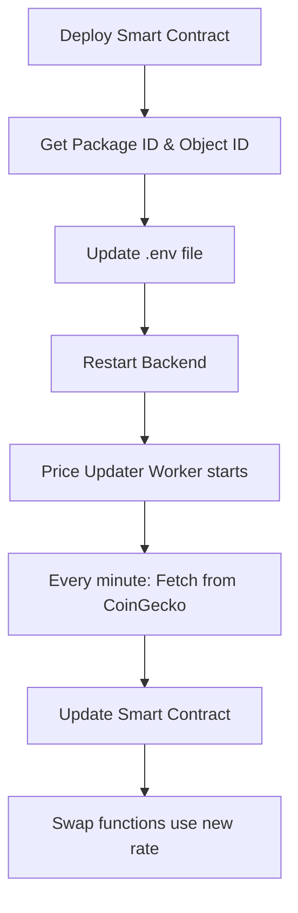

# Smart Contract Deployment Guide

## 🚀 Bước 1: Deploy Smart Contract lên Sui

### 1.1 Di chuyển đến thư mục smart contract
```bash
cd /Users/huc/Documents/CodewithHUC/swap
```

### 1.2 Publish smart contract
```bash
sui move publish
```

### 1.3 Lưu lại thông tin từ output
```bash
# Từ output của sui move publish, lưu lại:
# - Package ID: 0x...
# - Object ID của Price object: 0x...
```

## ⚙️ Bước 2: Cấu hình Backend

### 2.1 Cập nhật file .env
```bash
# Sui Blockchain Configuration
SUI_PACKAGE_ID=0x... # Package ID từ sui move publish
SUI_ORACLE_OBJECT_ID=0x... # Object ID của Price object
SUI_ADMIN_PRIVATE_KEY=your_admin_private_key
SUI_RPC_URL=https://fullnode.testnet.sui.io:443
```

### 2.2 Restart backend
```bash
cd /Users/huc/Documents/CodewithHUC/NFC-suipay/backend
npm run dev
```

## 🔄 Bước 3: Kiểm tra Price Updater Worker

### 3.1 Xem logs
```bash
# Backend sẽ tự động cập nhật tỉ giá mỗi phút
# Xem logs để kiểm tra:
tail -f logs/app.log | grep "Price updated"
```

### 3.2 Test manual update
```bash
# Test cập nhật tỉ giá ngay lập tức
curl -X POST http://localhost:8080/api/oracle/rate/update \
  -H "Authorization: Bearer YOUR_JWT_TOKEN"
```

## 📊 Bước 4: Kiểm tra Smart Contract

### 4.1 Xem tỉ giá hiện tại
```bash
curl -X GET http://localhost:8080/api/oracle/rate
```

### 4.2 Test chuyển đổi tiền tệ
```bash
curl -X POST http://localhost:8080/api/oracle/convert \
  -H "Content-Type: application/json" \
  -d '{"amount": 100, "from": "USD", "to": "VND"}'
```

## 🎯 Workflow hoàn chỉnh



## 🔧 Cấu hình nâng cao

### Thay đổi tần suất cập nhật
Trong file `src/workers/price-updater.worker.ts`:

```typescript
// Cập nhật mỗi 5 phút
cron.schedule('*/5 * * * *', async () => {
  await this.updatePrice();
});

// Cập nhật mỗi 30 giây
cron.schedule('*/30 * * * * *', async () => {
  await this.updatePrice();
});
```

### Thêm error handling
```typescript
// Trong updatePrice method
catch (error) {
  logger.error('❌ Failed to update price:', error);
  
  // Retry after 30 seconds
  setTimeout(() => {
    this.updatePrice();
  }, 30000);
}
```

## 📝 Monitoring

### 1. Xem logs real-time
```bash
tail -f logs/app.log | grep -E "(Price updated|Failed to update)"
```

### 2. Kiểm tra trạng thái worker
```bash
curl -X GET http://localhost:8080/api/oracle/rate
```

### 3. Test manual update
```bash
curl -X POST http://localhost:8080/api/oracle/rate/update \
  -H "Authorization: Bearer YOUR_JWT_TOKEN"
```

## 🚨 Troubleshooting

### Lỗi "Invalid Sui Object id"
- Kiểm tra SUI_ORACLE_OBJECT_ID có đúng không
- Đảm bảo smart contract đã được deploy

### Lỗi "Invalid params"
- Kiểm tra SUI_PACKAGE_ID có đúng không
- Đảm bảo admin private key có quyền update

### Worker không chạy
- Kiểm tra logs để xem lỗi
- Restart backend
- Kiểm tra cron expression

## ✅ Checklist

- [ ] Smart contract deployed
- [ ] Package ID và Object ID được lưu
- [ ] .env file được cập nhật
- [ ] Backend restarted
- [ ] Price updater worker chạy
- [ ] Tỉ giá được cập nhật mỗi phút
- [ ] Smart contract có tỉ giá mới
- [ ] Swap functions hoạt động với tỉ giá mới
