# ADMIN API REPORT - NFC PAYMENT SYSTEM
## Báo cáo API cho vai trò Admin (Quản trị viên)

---

## 👨‍💼 TỔNG QUAN ADMIN ROLE
**Vai trò:** Quản trị viên hệ thống thanh toán NFC
**Mục tiêu:** Giám sát toàn hệ thống, quản lý user/merchant, đảm bảo bảo mật, xử lý sự cố

---

## 🔐 1. XÁC THỰC ADMIN (Admin Authentication)

### 1.1. Tạo tài khoản admin (Chỉ dùng trong development)
```http
POST /api/auth/create-admin
Content-Type: application/json

{
  "email": "admin@nfcpay.com",
  "password": "Admin123!",
  "phoneNumber": "0999999999",
  "fullName": "System Administrator"
}
```

### 1.2. Đăng nhập admin
```http
POST /api/auth/login
Content-Type: application/json

{
  "email": "admin@nfcpay.com",
  "password": "Admin123!"
}
```

**Response:**
```json
{
  "success": true,
  "tokens": {
    "accessToken": "eyJhbGciOiJIUzI1NiIs...",
    "refreshToken": "eyJhbGciOiJIUzI1NiIs..."
  },
  "user": {
    "id": "68c19a2fe7d43ca708206510",
    "email": "admin@nfcpay.com",
    "fullName": "System Administrator",
    "role": "admin"
  }
}
```

---

## 📊 2. DASHBOARD & GIÁM SÁT TỔNG QUAN

### 2.1. Dashboard chính
```http
GET /api/admin/dashboard
Authorization: Bearer {adminToken}
```

**Response:**
```json
{
  "success": true,
  "data": {
    "totalTransactions": {
      "today": 11,
      "week": 15,
      "month": 15
    },
    "totalVolume": {
      "today": 0.115,
      "week": 6.115,
      "month": 6.115
    },
    "successRate": {
      "today": 27.27,
      "week": 20,
      "month": 20
    },
    "failureAnalysis": {
      "networkErrors": 0,
      "cardErrors": 0,
      "insufficientFunds": 0,
      "merchantErrors": 0,
      "systemErrors": 0
    },
    "activeCards": 6,
    "activeMerchants": 7,
    "averageTransactionTime": 0,
    "timestamp": "2025-09-10T15:33:27.344Z"
  }
}
```

### 2.2. Thống kê hệ thống chi tiết
```http
GET /api/admin/stats
Authorization: Bearer {adminToken}
```

**Response:**
```json
{
  "success": true,
  "data": {
    "transactionMetrics": [
      {
        "total": 13,
        "successful": 5,
        "failed": 0,
        "pending": 8,
        "totalVolume": 0.145
      }
    ],
    "errorMetrics": [],
    "performanceMetrics": {
      "avgProcessingTime": 0,
      "maxProcessingTime": 0,
      "minProcessingTime": 0
    },
    "systemStatus": {
      "activeUsers": 12,
      "activeMerchants": 7,
      "activeCards": 6,
      "databaseStatus": "healthy",
      "cacheStatus": "healthy",
      "queueStatus": "healthy"
    },
    "timestamp": "2025-09-10T15:33:36.350Z"
  }
}
```

### 2.3. Sức khỏe hệ thống
```http
GET /api/admin/health
Authorization: Bearer {adminToken}
```

**Response:**
```json
{
  "success": true,
  "data": {
    "status": "critical",
    "successRate": 38.46,
    "transactionMetrics": [
      {
        "total": 13,
        "successful": 5,
        "failed": 0,
        "pending": 8,
        "totalVolume": 0.145
      }
    ],
    "systemStatus": {
      "activeUsers": 12,
      "activeMerchants": 7,
      "activeCards": 6,
      "databaseStatus": "healthy",
      "cacheStatus": "healthy",
      "queueStatus": "healthy"
    },
    "alerts": [
      {
        "type": "warning",
        "message": "Success rate below 95% threshold",
        "timestamp": "2025-09-10T15:33:44.861Z"
      }
    ]
  }
}
```

---

## 👥 3. QUẢN LÝ NGƯỜI DÙNG (User Management)

### 3.1. Danh sách người dùng
```http
GET /api/admin/users?page=1&limit=20&status=active&role=user
Authorization: Bearer {adminToken}
```

**Response:**
```json
{
  "success": true,
  "data": {
    "users": [
      {
        "id": "68bf13c1746dd185de2ee844",
        "email": "user@example.com",
        "fullName": "Test User",
        "phoneNumber": "0123456789",
        "status": "active",
        "kycStatus": "verified",
        "role": "user",
        "dailyLimit": 5000000,
        "monthlyLimit": 100000000,
        "lastLogin": "2025-01-15T10:30:00Z",
        "createdAt": "2025-01-01T00:00:00Z",
        "transactionCount": 15,
        "totalVolume": 750000
      }
    ],
    "pagination": {
      "total": 12,
      "pages": 1,
      "currentPage": 1,
      "limit": 20
    }
  }
}
```

### 3.2. Chi tiết người dùng
```http
GET /api/admin/users/:userId
Authorization: Bearer {adminToken}
```

**Response:**
```json
{
  "success": true,
  "data": {
    "user": {
      "id": "68bf13c1746dd185de2ee844",
      "email": "user@example.com",
      "fullName": "Test User",
      "phoneNumber": "0123456789",
      "status": "active",
      "kycStatus": "verified",
      "role": "user",
      "dailyLimit": 5000000,
      "monthlyLimit": 100000000,
      "twoFactorEnabled": false,
      "lastLogin": "2025-01-15T10:30:00Z",
      "loginAttempts": 0,
      "createdAt": "2025-01-01T00:00:00Z"
    },
    "cards": [
      {
        "id": "64a1b2c3d4e5f6789",
        "cardUuid": "550e8400-e29b-41d4-a716-446655440000",
        "cardType": "standard",
        "isActive": true,
        "dailySpent": 150000,
        "monthlySpent": 2500000
      }
    ],
    "recentTransactions": [
      {
        "id": "68c0671bb6bf51e83abf681f",
        "amount": 50000,
        "status": "completed",
        "merchantName": "Coffee Shop ABC",
        "createdAt": "2025-01-15T10:30:00Z"
      }
    ],
    "statistics": {
      "totalTransactions": 25,
      "totalVolume": 1250000,
      "averageTransaction": 50000,
      "successRate": 96.0
    }
  }
}
```

### 3.3. Cập nhật trạng thái người dùng
```http
PUT /api/admin/users/:userId/status
Authorization: Bearer {adminToken}
Content-Type: application/json

{
  "status": "suspended",
  "reason": "Suspicious activity detected"
}
```

### 3.4. Cập nhật giới hạn người dùng
```http
PUT /api/admin/users/:userId/limits
Authorization: Bearer {adminToken}
Content-Type: application/json

{
  "dailyLimit": 10000000,
  "monthlyLimit": 200000000,
  "reason": "Premium user upgrade"
}
```

### 3.5. Xóa người dùng
```http
DELETE /api/admin/users/:userId
Authorization: Bearer {adminToken}
Content-Type: application/json

{
  "reason": "User requested account deletion"
}
```

---

## 🏪 4. QUẢN LÝ MERCHANT (Merchant Management)

### 4.1. Danh sách merchant
```http
GET /api/admin/merchants?page=1&limit=20&status=active&businessType=cafe
Authorization: Bearer {adminToken}
```

**Response:**
```json
{
  "success": true,
  "data": {
    "merchants": [
      {
        "id": "68bf165a1c4224c0707b6c5e",
        "merchantId": "mch_1234567890abcdef",
        "merchantName": "Coffee Shop ABC",
        "businessType": "cafe",
        "email": "merchant@coffeeshop.com",
        "phoneNumber": "0123456789",
        "address": "123 Nguyen Trai, Q1, HCM",
        "status": "active",
        "verificationStatus": "verified",
        "dailyVolume": 5000000,
        "monthlyVolume": 150000000,
        "transactionCount": 150,
        "successRate": 98.7,
        "createdAt": "2025-01-01T00:00:00Z"
      }
    ],
    "summary": {
      "totalMerchants": 7,
      "activeMerchants": 6,
      "pendingVerification": 1,
      "totalVolume": 500000000
    }
  }
}
```

### 4.2. Chi tiết merchant
```http
GET /api/admin/merchants/:merchantId
Authorization: Bearer {adminToken}
```

### 4.3. Cập nhật trạng thái merchant
```http
PUT /api/admin/merchants/:merchantId/status
Authorization: Bearer {adminToken}
Content-Type: application/json

{
  "status": "suspended",
  "reason": "High chargeback rate"
}
```

### 4.4. Sức khỏe thanh toán merchant
```http
GET /api/admin/payments/merchant-health
Authorization: Bearer {adminToken}
```

**Response:**
```json
{
  "success": true,
  "data": {
    "merchants": [
      {
        "merchantId": "68bf165a1c4224c0707b6c5e",
        "merchantName": "Coffee Shop ABC",
        "totalTransactions": 15,
        "successRate": 20,
        "failedTransactions": 1,
        "totalVolume": 6.115,
        "avgTransactionAmount": 0.41,
        "isHealthy": false
      }
    ],
    "summary": {
      "total": 2,
      "healthy": 1,
      "unhealthy": 1
    }
  }
}
```

### 4.5. Điều khiển khẩn cấp - Dừng merchant
```http
POST /api/admin/payments/emergency/stop-merchant/:merchantId
Authorization: Bearer {adminToken}
Content-Type: application/json

{
  "reason": "Emergency stop - fraud detection"
}
```

---

## 💳 5. QUẢN LÝ THẺ NFC (Card Management)

### 5.1. Sức khỏe thẻ tổng quan
```http
GET /api/admin/payments/card-health
Authorization: Bearer {adminToken}
```

**Response:**
```json
{
  "success": true,
  "data": {
    "cardStats": {
      "true": 6,
      "false": 1
    },
    "problematicCards": []
  }
}
```

### 5.2. Danh sách thẻ
```http
GET /api/admin/cards?page=1&limit=20&status=active&cardType=standard
Authorization: Bearer {adminToken}
```

### 5.3. Chi tiết thẻ
```http
GET /api/admin/cards/:cardId
Authorization: Bearer {adminToken}
```

### 5.4. Khóa thẻ
```http
POST /api/admin/cards/:cardId/block
Authorization: Bearer {adminToken}
Content-Type: application/json

{
  "reason": "Fraudulent activity detected"
}
```

### 5.5. Mở khóa thẻ
```http
POST /api/admin/cards/:cardId/unblock
Authorization: Bearer {adminToken}
Content-Type: application/json

{
  "reason": "False positive resolved"
}
```

### 5.6. Cập nhật trạng thái thẻ
```http
PUT /api/admin/cards/:cardId/status
Authorization: Bearer {adminToken}
Content-Type: application/json

{
  "status": "inactive",
  "reason": "Card expired"
}
```

---

## 💰 6. QUẢN LÝ GIAO DỊCH (Transaction Management)

### 6.1. Danh sách giao dịch
```http
GET /api/admin/transactions?page=1&limit=20&status=completed&startDate=2025-01-01&endDate=2025-01-31
Authorization: Bearer {adminToken}
```

**Response:**
```json
{
  "success": true,
  "data": {
    "transactions": [
      {
        "id": "68c0671bb6bf51e83abf681f",
        "userId": {
          "email": "user@example.com",
          "fullName": "Test User"
        },
        "cardUuid": "550e8400-e29b-41d4-a716-446655440000",
        "txHash": "rPJL7BqqPRmvy1k5wtPd9DPoeo17Y5p2Xr1P4THmPyv",
        "type": "payment",
        "amount": 0.01,
        "currency": "SUI",
        "merchantId": {
          "merchantName": "Coffee Shop ABC",
          "businessType": "cafe"
        },
        "status": "completed",
        "gasFee": 0.001,
        "totalAmount": 0.011,
        "fromAddress": "0xf3ad909893af3343b34db08155f7f8073ee0321f00a4bdfe1cee961238ed5de2",
        "toAddress": "0xe92bfd25182a0562f126a364881502761c7d20739585234288728f449fc51bda",
        "createdAt": "2025-09-09T17:42:51.596Z",
        "completedAt": "2025-09-09T17:42:55.941Z"
      }
    ],
    "total": 17,
    "pages": 4,
    "currentPage": 1
  }
}
```

### 6.2. Chi tiết giao dịch
```http
GET /api/admin/transactions/:transactionId
Authorization: Bearer {adminToken}
```

**Response:**
```json
{
  "success": true,
  "data": {
    "id": "68c0671bb6bf51e83abf681f",
    "userId": {
      "email": "user@example.com",
      "phoneNumber": "0123456789",
      "fullName": "Test User"
    },
    "cardUuid": "550e8400-e29b-41d4-a716-446655440000",
    "txHash": "rPJL7BqqPRmvy1k5wtPd9DPoeo17Y5p2Xr1P4THmPyv",
    "type": "payment",
    "amount": 0.01,
    "currency": "SUI",
    "merchantId": {
      "merchantName": "Coffee Shop ABC",
      "businessType": "cafe"
    },
    "status": "completed",
    "metadata": {
      "ipAddress": "::ffff:127.0.0.1",
      "userAgent": "curl/7.82.0"
    },
    "createdAt": "2025-09-09T17:42:51.596Z",
    "completedAt": "2025-09-09T17:42:55.941Z"
  }
}
```

### 6.3. Cập nhật trạng thái giao dịch
```http
PUT /api/admin/transactions/:transactionId/status
Authorization: Bearer {adminToken}
Content-Type: application/json

{
  "status": "failed",
  "reason": "Admin test - payment timeout"
}
```

**Response:**
```json
{
  "success": true,
  "message": "Transaction status updated successfully",
  "data": {
    "id": "68c065fd3f23a235f1c3d20b",
    "status": "failed",
    "metadata": {
      "statusChangeReason": "Admin test - payment timeout",
      "statusChangedBy": "68c19a2fe7d43ca708206510",
      "statusChangeDate": "2025-09-10T15:34:24.409Z",
      "previousStatus": "pending"
    }
  }
}
```

### 6.4. Hoàn tiền (Force Refund)
```http
POST /api/admin/transactions/:transactionId/refund
Authorization: Bearer {adminToken}
Content-Type: application/json

{
  "reason": "Customer complaint - defective product",
  "refundAmount": 50000
}
```

### 6.5. Giám sát thanh toán trực tiếp
```http
GET /api/admin/payments/live
Authorization: Bearer {adminToken}
```

**Response:**
```json
{
  "success": true,
  "data": {
    "transactions": [],
    "total": 0,
    "pages": 0,
    "currentPage": 1
  }
}
```

### 6.6. Phân tích lỗi thanh toán
```http
GET /api/admin/payments/failures?period=week&limit=50
Authorization: Bearer {adminToken}
```

---

## 🔍 7. KYC & XÁC THỰC (KYC Management)

### 7.1. Danh sách yêu cầu KYC
```http
GET /api/admin/kyc?status=pending&page=1&limit=20
Authorization: Bearer {adminToken}
```

### 7.2. Chi tiết KYC
```http
GET /api/admin/kyc/:kycId
Authorization: Bearer {adminToken}
```

### 7.3. Phê duyệt KYC
```http
POST /api/admin/kyc/:kycId/approve
Authorization: Bearer {adminToken}
Content-Type: application/json

{
  "notes": "Documents verified successfully"
}
```

### 7.4. Từ chối KYC
```http
POST /api/admin/kyc/:kycId/reject
Authorization: Bearer {adminToken}
Content-Type: application/json

{
  "reason": "Invalid document format",
  "notes": "Please resubmit with clear images"
}
```

---

## ⚙️ 8. CÀI ĐẶT HỆ THỐNG (System Settings)

### 8.1. Lấy cài đặt hệ thống
```http
GET /api/admin/settings
Authorization: Bearer {adminToken}
```

### 8.2. Cập nhật cài đặt
```http
PUT /api/admin/settings
Authorization: Bearer {adminToken}
Content-Type: application/json

{
  "systemSettings": {
    "maintenanceMode": false,
    "maxDailyVolume": 10000000000,
    "defaultTransactionFee": 0.025
  },
  "securitySettings": {
    "maxLoginAttempts": 5,
    "sessionTimeout": 3600,
    "require2FA": true
  },
  "paymentSettings": {
    "maxTransactionAmount": 100000000,
    "minTransactionAmount": 1000,
    "transactionTimeout": 300
  }
}
```

---

## 🛠️ 9. BẢO TRÌ HỆ THỐNG (System Maintenance)

### 9.1. Bật chế độ bảo trì
```http
POST /api/admin/maintenance/enable
Authorization: Bearer {adminToken}
Content-Type: application/json

{
  "message": "System maintenance in progress. Expected duration: 30 minutes.",
  "estimatedDuration": 1800
}
```

### 9.2. Tắt chế độ bảo trì
```http
POST /api/admin/maintenance/disable
Authorization: Bearer {adminToken}
```

### 9.3. Xóa cache
```http
POST /api/admin/cache/clear
Authorization: Bearer {adminToken}
Content-Type: application/json

{
  "cacheType": "all"
}
```

---

## 📋 10. AUDIT LOGS (Nhật ký kiểm toán)

### 10.1. Danh sách audit logs
```http
GET /api/admin/audit-logs?page=1&limit=50&action=transaction_update&userId=64a1b2c3d4e5f6789
Authorization: Bearer {adminToken}
```

### 10.2. Chi tiết audit log
```http
GET /api/admin/audit-logs/:logId
Authorization: Bearer {adminToken}
```

---

## 📱 11. QUY TRÌNH SỬ DỤNG CHO ADMIN FRONTEND

### 11.1. Quy trình giám sát hệ thống hàng ngày

```mermaid
sequenceDiagram
    participant A as Admin
    participant F as Frontend
    participant API as API Server
    participant DB as Database

    A->>F: Login vào admin panel
    F->>API: POST /api/auth/login
    API->>F: Return admin token
    
    F->>API: GET /api/admin/dashboard
    API->>DB: Query system metrics
    DB->>API: Return metrics data
    API->>F: Dashboard data
    F->>A: Hiển thị dashboard
    
    F->>API: GET /api/admin/health
    API->>F: System health status
    F->>A: Hiển thị alerts (nếu có)
```


### 11.2. Quy trình xử lý sự cố thanh toán

```mermaid
sequenceDiagram
    participant A as Admin
    participant F as Frontend
    participant API as API Server
    participant M as Merchant
    participant U as User

    A->>F: Nhận cảnh báo transaction failed
    F->>API: GET /api/admin/transactions/:id
    API->>F: Chi tiết transaction
    F->>A: Hiển thị thông tin lỗi
    
    A->>F: Quyết định xử lý (refund/retry/investigate)
    F->>API: POST /api/admin/transactions/:id/refund
    API->>F: Refund processed
    F->>M: Webhook notification
    F->>U: Email notification
    F->>A: Confirmation "Refund completed"
```


### 11.3. Quy trình phê duyệt KYC

```mermaid
sequenceDiagram
    participant A as Admin
    participant F as Frontend
    participant API as API Server
    participant U as User
    participant E as Email Service

    F->>API: GET /api/admin/kyc (pending requests)
    API->>F: KYC requests list
    A->>F: Click review KYC request
    
    F->>API: GET /api/admin/kyc/:id
    API->>F: KYC documents & info
    F->>A: Hiển thị documents để review
    
    A->>F: Approve/Reject KYC
    F->>API: POST /api/admin/kyc/:id/approve
    API->>E: Send notification email
    E->>U: KYC approved email
    API->>F: Success confirmation
    F->>A: "KYC approved successfully"
```


---

## 🎨 12. GỢI Ý THIẾT KẾ ADMIN FRONTEND

### 12.1. Admin Dashboard
- **Header:** System logo, admin name, notifications, quick actions
- **Key Metrics Cards:** 
  - Transaction volume (today/week/month)
  - Success rate with trend indicators
  - Active users/merchants/cards
  - System health status with color coding
- **Charts:**
  - Transaction volume over time (line chart)
  - Success rate trend (area chart)
  - Payment method distribution (pie chart)
  - Error rate by type (bar chart)
- **Alerts Panel:** Critical issues requiring immediate attention
- **Quick Actions:** Emergency controls, maintenance mode, user lookup

### 12.2. Transaction Management
- **Filter Panel:** 
  - Date range picker
  - Status multiselect (completed, pending, failed)
  - Amount range slider
  - User/merchant search
- **Transaction Table:**
  - Sortable columns: Date, Amount, Status, User, Merchant
  - Status badges with color coding
  - Action buttons: View details, Refund, Update status
- **Transaction Details Modal:**
  - Complete transaction info
  - Timeline of status changes
  - Admin action history
  - Refund/update forms

### 12.3. User & Merchant Management
- **User List:**
  - Avatar, name, email, status
  - KYC status indicators
  - Transaction count/volume
  - Last login timestamp
  - Quick actions: Block/unblock, view details
- **User Details:**
  - Profile information
  - KYC documents viewer
  - Transaction history
  - Card management
  - Limit adjustment forms
- **Merchant Dashboard:**
  - Business info and verification status
  - Payment volume and success rate
  - API key management
  - Webhook configuration

### 12.4. System Health Monitoring
- **Real-time Metrics:**
  - Transaction processing rate (TPS)
  - System response time
  - Error rate percentage
  - Database performance
- **Service Status Grid:**
  - API server, Database, Cache, Queue system
  - Green/yellow/red status indicators
  - Last health check timestamps
- **Alert Management:**
  - Alert history table
  - Notification settings
  - Escalation rules

### 12.5. KYC Review Interface
- **KYC Queue:**
  - Pending requests with priority
  - Review deadline indicators
  - Assigned reviewer
- **Document Viewer:**
  - Image gallery with zoom/rotate
  - Document type classification
  - OCR text extraction display
- **Review Form:**
  - Approval/rejection radio buttons
  - Comment text area
  - Standard rejection reasons dropdown

---

## 🔄 13. REAL-TIME UPDATES CHO ADMIN

### WebSocket Events:
```javascript
// Admin WebSocket connection
const adminWS = new WebSocket('ws://localhost:8080/admin');

// Critical system events
adminWS.on('system_alert', (data) => {
  showCriticalAlert(data.type, data.message);
  updateSystemHealthIndicator(data.severity);
});

adminWS.on('transaction_failed', (data) => {
  addToFailedTransactionsList(data);
  updateFailureMetrics();
});

adminWS.on('merchant_verification_needed', (data) => {
  addToVerificationQueue(data.merchantId);
  showNotification('New merchant pending verification');
});

adminWS.on('high_failure_rate_detected', (data) => {
  showAlert('HIGH_FAILURE_RATE', data);
  highlightProblematicMerchant(data.merchantId);
});

adminWS.on('kyc_submission', (data) => {
  addToKYCQueue(data.userId, data.kycId);
  updateKYCPendingCount();
});

// Real-time metrics updates
adminWS.on('metrics_update', (data) => {
  updateDashboardMetrics(data.transactions, data.volume, data.successRate);
  updateCharts(data.hourlyData);
});
```

### Server-Sent Events cho live monitoring:
```javascript
// Live transaction monitoring
const eventSource = new EventSource('/api/admin/live-stream');

eventSource.addEventListener('transaction_created', (event) => {
  const transaction = JSON.parse(event.data);
  addToLiveTransactionFeed(transaction);
});

eventSource.addEventListener('transaction_completed', (event) => {
  const transaction = JSON.parse(event.data);
  updateTransactionStatus(transaction.id, 'completed');
  updateSuccessMetrics();
});

eventSource.addEventListener('system_metric', (event) => {
  const metrics = JSON.parse(event.data);
  updateRealTimeMetrics(metrics);
});
```

---

## ⚠️ 14. XỬ LÝ LỖI & ALERTS

### 14.1. Alert Levels:
- **CRITICAL:** System down, security breach, payment failures >50%
- **WARNING:** High error rate, unusual patterns, service degradation  
- **INFO:** Maintenance scheduled, new user registrations, routine updates

### 14.2. Emergency Response Actions:
```javascript
// Emergency action handlers
const emergencyActions = {
  stopAllPayments: async () => {
    await api.post('/api/admin/maintenance/enable', {
      message: 'Emergency: All payments suspended',
      emergency: true
    });
  },
  
  blockSuspiciousMerchant: async (merchantId) => {
    await api.put(`/api/admin/merchants/${merchantId}/status`, {
      status: 'suspended',
      reason: 'Emergency: Suspicious activity detected'
    });
  },
  
  triggerFailover: async () => {
    await api.post('/api/admin/system/failover', {
      target: 'backup_server'
    });
  }
};
```

### 14.3. Error Code Handling:
```javascript
const adminErrorHandler = {
  'SYSTEM_001': 'Database connection failed',
  'SYSTEM_002': 'Queue system unavailable', 
  'SECURITY_001': 'Unauthorized access attempt',
  'SECURITY_002': 'Rate limit exceeded',
  'PAYMENT_001': 'Blockchain network error',
  'PAYMENT_002': 'High transaction failure rate'
};
```

---

## 📊 15. BÁO CÁO & ANALYTICS

### 15.1. Revenue Analytics
```http
GET /api/admin/analytics/revenue?period=month&groupBy=day
Authorization: Bearer {adminToken}
```

### 15.2. User Behavior Analytics
```http
GET /api/admin/analytics/users?metrics=growth,retention,activity&period=quarter
Authorization: Bearer {adminToken}
```

### 15.3. System Performance Reports
```http
GET /api/admin/reports/performance?startDate=2025-01-01&endDate=2025-01-31&format=pdf
Authorization: Bearer {adminToken}
```

### 15.4. Compliance Reports
```http
GET /api/admin/reports/compliance?type=kyc,transaction&month=2025-01
Authorization: Bearer {adminToken}
```

---

## 🔒 16. BẢO MẬT & PHÂN QUYỀN

### 16.1. Role-based Access Control:
- **Super Admin:** Full system access, user management, system settings
- **Operations Admin:** Transaction management, user support, KYC review
- **Security Admin:** Audit logs, security settings, emergency controls
- **Read-only Admin:** Dashboard viewing, report generation

### 16.2. IP Whitelisting:
```json
{
  "allowedIPs": [
    "192.168.1.0/24",
    "10.0.0.0/8", 
    "203.113.XXX.XXX"
  ],
  "blockSuspiciousIPs": true,
  "maxFailedAttempts": 3
}
```

### 16.3. Audit Logging:
Tất cả admin actions được log:
```json
{
  "timestamp": "2025-01-15T10:30:00Z",
  "adminId": "68c19a2fe7d43ca708206510",
  "action": "UPDATE_TRANSACTION_STATUS",
  "resource": "transaction:68c065fd3f23a235f1c3d20b",
  "oldValue": "pending",
  "newValue": "failed",
  "reason": "Admin test - payment timeout",
  "ipAddress": "192.168.1.100",
  "userAgent": "Mozilla/5.0..."
}
```

---

## 📋 17. CHECKLIST PHÁT TRIỂN ADMIN PANEL

### Phase 1 - Core Admin:
- [ ] Admin authentication & authorization
- [ ] Dashboard với key metrics
- [ ] Transaction listing & details
- [ ] User management basic functions
- [ ] System health monitoring

### Phase 2 - Operations:
- [ ] KYC review workflow  
- [ ] Merchant verification process
- [ ] Transaction refund system
- [ ] Real-time alerts & notifications
- [ ] Emergency controls

### Phase 3 - Advanced Analytics:
- [ ] Advanced reporting system
- [ ] Revenue analytics dashboard
- [ ] User behavior insights
- [ ] Performance monitoring
- [ ] Compliance reporting

### Phase 4 - Automation:
- [ ] Automated fraud detection
- [ ] AI-powered KYC review
- [ ] Smart alerting rules
- [ ] Auto-scaling controls
- [ ] Predictive analytics

### Phase 5 - Enterprise:
- [ ] Multi-tenant support
- [ ] Advanced RBAC
- [ ] API rate limiting
- [ ] White-label admin panel
- [ ] Advanced security features

---

## 🔧 18. INTEGRATION & DEPLOYMENT

### 18.1. Monitoring Integration:
```javascript
// Integrate with monitoring services
const monitoring = {
  datadog: {
    apiKey: process.env.DATADOG_API_KEY,
    metrics: ['transaction.count', 'transaction.success_rate', 'system.health']
  },
  newrelic: {
    licenseKey: process.env.NEWRELIC_LICENSE_KEY,
    appName: 'NFC-Payment-Admin'
  }
};
```

### 18.2. Notification Integration:
```javascript
// Slack/Email notifications for critical alerts
const notifications = {
  slack: {
    webhookUrl: process.env.SLACK_WEBHOOK_URL,
    channel: '#nfc-payment-alerts'
  },
  email: {
    smtp: process.env.SMTP_CONFIG,
    adminEmails: ['admin@nfcpay.com', 'ops@nfcpay.com']
  }
};
```

---

*Báo cáo này cung cấp đầy đủ thông tin API và quy trình để phát triển frontend cho admin role trong hệ thống NFC Payment. Admin panel được thiết kế để đảm bảo giám sát toàn diện, xử lý sự cố nhanh chóng và duy trì tính bảo mật cao cho hệ thống.*