# MERCHANT API REPORT - NFC PAYMENT SYSTEM
## Báo cáo API cho vai trò Merchant (Thương gia)

---

## 🏪 TỔNG QUAN MERCHANT ROLE
**Vai trò:** Thương gia nhận thanh toán NFC từ khách hàng
**Mục tiêu:** Quản lý cửa hàng, nhận thanh toán, theo dõi doanh thu, quản lý API keys & webhooks

---

## 🔐 1. ĐĂNG KÝ & XÁC THỰC (Merchant Authentication)

### 1.1. Đăng ký merchant
```http
POST /api/merchants/register
Content-Type: application/json

{
  "merchantName": "Coffee Shop ABC",
  "businessType": "cafe",
  "email": "merchant@coffeeshop.com",
  "phoneNumber": "0123456789",
  "address": "123 Nguyen Trai, Q1, HCM",
  "taxId": "0123456789",
  "bankAccount": {
    "bankName": "Vietcombank",
    "accountNumber": "1234567890",
    "accountName": "COFFEE SHOP ABC"
  },
  "ownerInfo": {
    "fullName": "Nguyen Van Owner",
    "idNumber": "123456789",
    "phoneNumber": "0987654321"
  }
}
```

**Response:**
```json
{
  "success": true,
  "message": "Merchant registration successful. Awaiting verification.",
  "data": {
    "merchantId": "mch_1234567890abcdef",
    "merchantName": "Coffee Shop ABC",
    "status": "pending",
    "verificationRequired": true,
    "apiKey": {
      "publicKey": "pk_test_1234567890abcdef",
      "secretKey": "sk_test_abcdef1234567890"
    }
  }
}
```

### 1.2. Lấy thông tin merchant công khai
```http
GET /api/merchants/public/:merchantId
```

**Response:**
```json
{
  "success": true,
  "data": {
    "merchantId": "mch_1234567890abcdef",
    "merchantName": "Coffee Shop ABC",
    "businessType": "cafe",
    "logo": "https://cdn.example.com/logo.png",
    "address": "123 Nguyen Trai, Q1, HCM",
    "acceptedPayments": ["nfc", "qr"],
    "isActive": true
  }
}
```

---

## 🏪 2. QUẢN LÝ PROFILE MERCHANT

### 2.1. Lấy profile merchant
```http
GET /api/merchants/profile
Authorization: X-API-Key: pk_test_1234567890abcdef
X-API-Secret: sk_test_abcdef1234567890
```

**Response:**
```json
{
  "success": true,
  "data": {
    "merchantId": "mch_1234567890abcdef",
    "merchantName": "Coffee Shop ABC",
    "businessType": "cafe",
    "email": "merchant@coffeeshop.com",
    "phoneNumber": "0123456789",
    "address": "123 Nguyen Trai, Q1, HCM",
    "status": "active",
    "verificationStatus": "verified",
    "paymentMethods": ["nfc", "qr"],
    "dailyLimit": 100000000,
    "monthlyLimit": 2000000000,
    "transactionFee": 0.025,
    "settlementSchedule": "daily",
    "createdAt": "2025-01-01T00:00:00Z"
  }
}
```

### 2.2. Cập nhật profile
```http
PUT /api/merchants/profile
Authorization: X-API-Key: pk_test_1234567890abcdef
X-API-Secret: sk_test_abcdef1234567890
Content-Type: application/json

{
  "merchantName": "Coffee Shop ABC Premium",
  "address": "456 Le Loi, Q3, HCM",
  "phoneNumber": "0123456788",
  "logo": "base64_image_data",
  "businessHours": {
    "monday": {"open": "07:00", "close": "22:00"},
    "tuesday": {"open": "07:00", "close": "22:00"}
  }
}
```

---

## 💰 3. QUẢN LÝ THANH TOÁN (Payment Management)

### 3.1. Tạo payment request (cho QR payment)
```http
POST /api/payment/merchant/create-request
Authorization: X-API-Key: pk_test_1234567890abcdef
X-API-Secret: sk_test_abcdef1234567890
Content-Type: application/json

{
  "amount": 50000,
  "currency": "SUI",
  "description": "Coffee + Cake",
  "orderId": "ORDER_123456",
  "expiresIn": 300,
  "metadata": {
    "items": [
      {"name": "Coffee", "price": 30000, "quantity": 1},
      {"name": "Cake", "price": 20000, "quantity": 1}
    ],
    "table": "Table 5"
  }
}
```

**Response:**
```json
{
  "success": true,
  "data": {
    "paymentRequestId": "req_1234567890abcdef",
    "qrCode": "data:image/png;base64,iVBORw0KGgoAAAANSUhEUgAA...",
    "qrString": "nfcpay://pay/mch_1234567890abcdef?amount=50000&req=req_1234567890abcdef",
    "amount": 50000,
    "currency": "SUI",
    "expiresAt": "2025-01-15T10:35:00Z",
    "status": "pending"
  }
}
```

### 3.2. Kiểm tra trạng thái payment request
```http
GET /api/payment/merchant/request/:requestId
Authorization: X-API-Key: pk_test_1234567890abcdef
X-API-Secret: sk_test_abcdef1234567890
```

**Response:**
```json
{
  "success": true,
  "data": {
    "paymentRequestId": "req_1234567890abcdef",
    "status": "completed",
    "transactionId": "64a1b2c3d4e5f6789",
    "amount": 50000,
    "paidAmount": 50000,
    "txHash": "0x1a2b3c4d5e6f7890...",
    "paidAt": "2025-01-15T10:33:00Z",
    "customer": {
      "userId": "64a1b2c3d4e5f6789",
      "fullName": "Nguyen Van A"
    }
  }
}
```

### 3.3. Lấy danh sách thanh toán
```http
GET /api/merchants/payments?page=1&limit=20&status=completed&startDate=2025-01-01&endDate=2025-01-31
Authorization: X-API-Key: pk_test_1234567890abcdef
X-API-Secret: sk_test_abcdef1234567890
```

**Response:**
```json
{
  "success": true,
  "data": {
    "payments": [
      {
        "id": "64a1b2c3d4e5f6789",
        "amount": 50000,
        "currency": "SUI",
        "status": "completed",
        "orderId": "ORDER_123456",
        "description": "Coffee + Cake",
        "txHash": "0x1a2b3c4d5e6f7890...",
        "customerName": "Nguyen Van A",
        "paymentMethod": "nfc",
        "fee": 1250,
        "netAmount": 48750,
        "createdAt": "2025-01-15T10:30:00Z",
        "completedAt": "2025-01-15T10:33:00Z"
      }
    ],
    "summary": {
      "totalAmount": 5000000,
      "totalFee": 125000,
      "netAmount": 4875000,
      "totalTransactions": 100,
      "successRate": 98.5
    },
    "pagination": {
      "total": 100,
      "pages": 5,
      "currentPage": 1,
      "limit": 20
    }
  }
}
```

### 3.4. Hoàn tiền (Refund)
```http
POST /api/merchants/payments/refund/:paymentId
Authorization: X-API-Key: pk_test_1234567890abcdef
X-API-Secret: sk_test_abcdef1234567890
Content-Type: application/json

{
  "amount": 50000,
  "reason": "Customer cancelled order",
  "refundType": "full"
}
```

**Response:**
```json
{
  "success": true,
  "message": "Refund processed successfully",
  "data": {
    "refundId": "ref_1234567890abcdef",
    "originalPaymentId": "64a1b2c3d4e5f6789",
    "refundAmount": 50000,
    "refundTxHash": "0x9f8e7d6c5b4a3210...",
    "status": "completed",
    "processedAt": "2025-01-15T15:00:00Z"
  }
}
```

---

## 📊 4. THỐNG KÊ & BÁO CÁO (Analytics)

### 4.1. Thống kê tổng quan
```http
GET /api/merchants/payments/stats?period=week
Authorization: X-API-Key: pk_test_1234567890abcdef
X-API-Secret: sk_test_abcdef1234567890
```

**Response:**
```json
{
  "success": true,
  "data": {
    "period": "week",
    "totalRevenue": 15000000,
    "totalTransactions": 300,
    "averageTransactionValue": 50000,
    "successRate": 98.7,
    "topPaymentMethod": "nfc",
    "dailyBreakdown": [
      {
        "date": "2025-01-15",
        "revenue": 2500000,
        "transactions": 50,
        "successRate": 98.0
      }
    ],
    "hourlyPattern": [
      {"hour": 7, "transactions": 5, "revenue": 250000},
      {"hour": 8, "transactions": 15, "revenue": 750000}
    ],
    "comparisonWithPrevious": {
      "revenueGrowth": 15.5,
      "transactionGrowth": 8.2
    }
  }
}
```

### 4.2. Top sản phẩm/đơn hàng
```http
GET /api/merchants/analytics/top-orders?period=month&limit=10
Authorization: X-API-Key: pk_test_1234567890abcdef
X-API-Secret: sk_test_abcdef1234567890
```

**Response:**
```json
{
  "success": true,
  "data": {
    "topOrders": [
      {
        "description": "Coffee + Cake",
        "count": 150,
        "totalRevenue": 7500000,
        "averageAmount": 50000
      }
    ],
    "paymentMethodStats": {
      "nfc": {"count": 250, "revenue": 12500000, "percentage": 83.3},
      "qr": {"count": 50, "revenue": 2500000, "percentage": 16.7}
    },
    "customerInsights": {
      "newCustomers": 45,
      "returningCustomers": 125,
      "averageCustomerValue": 300000
    }
  }
}
```

---

## 🔧 5. QUẢN LÝ API KEYS

### 5.1. Lấy danh sách API keys
```http
GET /api/merchants/api-keys
Authorization: X-API-Key: pk_test_1234567890abcdef
X-API-Secret: sk_test_abcdef1234567890
```

**Response:**
```json
{
  "success": true,
  "data": [
    {
      "id": "key_1234567890abcdef",
      "name": "Main POS System",
      "publicKey": "pk_test_1234567890abcdef",
      "secretKey": "sk_test_****7890",
      "permissions": ["payments.create", "payments.read", "refunds.create"],
      "environment": "test",
      "isActive": true,
      "lastUsed": "2025-01-15T10:30:00Z",
      "createdAt": "2025-01-01T00:00:00Z"
    }
  ]
}
```

### 5.2. Tạo API key mới
```http
POST /api/merchants/api-keys
Authorization: X-API-Key: pk_test_1234567890abcdef
X-API-Secret: sk_test_abcdef1234567890
Content-Type: application/json

{
  "name": "Mobile App",
  "permissions": ["payments.create", "payments.read"],
  "environment": "production"
}
```

**Response:**
```json
{
  "success": true,
  "message": "API key created successfully",
  "data": {
    "id": "key_0987654321fedcba",
    "name": "Mobile App",
    "publicKey": "pk_live_0987654321fedcba",
    "secretKey": "sk_live_fedcba0987654321",
    "permissions": ["payments.create", "payments.read"],
    "environment": "production",
    "isActive": true
  }
}
```

### 5.3. Xóa API key
```http
DELETE /api/merchants/api-keys/:keyId
Authorization: X-API-Key: pk_test_1234567890abcdef
X-API-Secret: sk_test_abcdef1234567890
```

---

## 🔔 6. WEBHOOK MANAGEMENT

### 6.1. Lấy danh sách webhooks
```http
GET /api/merchants/webhooks
Authorization: X-API-Key: pk_test_1234567890abcdef
X-API-Secret: sk_test_abcdef1234567890
```

**Response:**
```json
{
  "success": true,
  "data": [
    {
      "id": "wh_1234567890abcdef",
      "url": "https://merchant.coffeeshop.com/webhooks/payment",
      "events": ["payment.completed", "payment.failed", "refund.completed"],
      "isActive": true,
      "secret": "whsec_****abcdef",
      "lastDelivery": "2025-01-15T10:35:00Z",
      "failureCount": 0,
      "createdAt": "2025-01-01T00:00:00Z"
    }
  ]
}
```

### 6.2. Tạo webhook mới
```http
POST /api/merchants/webhooks
Authorization: X-API-Key: pk_test_1234567890abcdef
X-API-Secret: sk_test_abcdef1234567890
Content-Type: application/json

{
  "url": "https://merchant.coffeeshop.com/webhooks/payment",
  "events": ["payment.completed", "payment.failed", "refund.completed"],
  "description": "Main payment webhook"
}
```

**Response:**
```json
{
  "success": true,
  "message": "Webhook created successfully",
  "data": {
    "id": "wh_1234567890abcdef",
    "url": "https://merchant.coffeeshop.com/webhooks/payment",
    "events": ["payment.completed", "payment.failed", "refund.completed"],
    "secret": "whsec_1234567890abcdef",
    "isActive": true
  }
}
```

### 6.3. Test webhook
```http
POST /api/merchants/webhooks/:webhookId/test
Authorization: X-API-Key: pk_test_1234567890abcdef
X-API-Secret: sk_test_abcdef1234567890
```

---

## ⚙️ 7. CÀI ĐẶT MERCHANT (Settings)

### 7.1. Lấy cài đặt
```http
GET /api/merchants/settings
Authorization: X-API-Key: pk_test_1234567890abcdef
X-API-Secret: sk_test_abcdef1234567890
```

**Response:**
```json
{
  "success": true,
  "data": {
    "paymentSettings": {
      "autoConfirm": true,
      "confirmationTimeout": 300,
      "maxTransactionAmount": 10000000,
      "allowPartialPayments": false
    },
    "notificationSettings": {
      "emailNotifications": true,
      "smsNotifications": false,
      "webhookRetries": 3
    },
    "businessSettings": {
      "timezone": "Asia/Ho_Chi_Minh",
      "currency": "SUI",
      "language": "vi",
      "receiptTemplate": "default"
    },
    "securitySettings": {
      "ipWhitelist": ["192.168.1.0/24"],
      "requireHttps": true,
      "apiRateLimit": 1000
    }
  }
}
```

### 7.2. Cập nhật cài đặt
```http
PUT /api/merchants/settings
Authorization: X-API-Key: pk_test_1234567890abcdef
X-API-Secret: sk_test_abcdef1234567890
Content-Type: application/json

{
  "paymentSettings": {
    "autoConfirm": false,
    "confirmationTimeout": 600,
    "maxTransactionAmount": 5000000
  },
  "notificationSettings": {
    "emailNotifications": true,
    "smsNotifications": true
  }
}
```

---

## 📱 8. QUY TRÌNH SỬ DỤNG CHO MERCHANT FRONTEND

### 8.1. Quy trình đăng ký merchant

```mermaid
sequenceDiagram
    participant M as Merchant
    participant F as Frontend
    participant A as API Server
    participant V as Verification Service

    M->>F: Điền form đăng ký
    F->>A: POST /api/merchants/register
    A->>V: Gửi documents để verify
    A->>F: Trả về merchant ID + API keys
    F->>M: Hiển thị "Đang chờ xác thực"
    
    V->>A: Verification completed
    A->>M: Email notification
    M->>F: Login với API keys
    F->>A: GET /api/merchants/profile
    A->>F: Merchant data (status: active)
    F->>M: Chuyển đến dashboard
```


### 8.2. Quy trình nhận thanh toán QR

```mermaid
sequenceDiagram
    participant M as Merchant
    participant F as Frontend
    participant A as API Server
    participant U as Customer App
    participant B as Blockchain

    M->>F: Nhập amount + order info
    F->>A: POST /api/payment/merchant/create-request
    A->>F: Trả về QR code + request ID
    F->>M: Hiển thị QR code
    
    U->>F: Scan QR code
    U->>A: POST /api/payment/create (with request ID)
    A->>B: Process payment
    B->>A: Payment confirmed
    A->>F: Webhook/WebSocket notification
    F->>M: Hiển thị "Thanh toán thành công"
```


### 8.3. Quy trình nhận thanh toán NFC

```mermaid
sequenceDiagram
    participant M as Merchant POS
    participant F as Frontend
    participant A as API Server
    participant U as User NFC Card
    participant B as Blockchain

    M->>F: Nhập amount + order info
    F->>M: Hiển thị "Chờ tap thẻ"
    
    U->>M: Tap NFC card
    M->>F: Read card UUID
    F->>A: POST /api/payment/nfc/process
    A->>B: Validate & process
    B->>A: Payment result
    A->>F: Payment status
    F->>M: Hiển thị kết quả + receipt
```


---

## 🎨 9. GỢI Ý THIẾT KẾ MERCHANT FRONTEND

### 9.1. Merchant Dashboard
- **Header:** Logo merchant, tên cửa hàng, notifications, profile menu
- **Revenue Cards:** Hôm nay, tuần này, tháng này với % thay đổi
- **Quick Stats:** Total transactions, success rate, average order value
- **Recent Payments:** Danh sách 10 thanh toán gần nhất với trạng thái
- **Quick Actions:** Create QR, View reports, Settings

### 9.2. Payment Terminal (POS Interface)
- **Order Input:** Calculator-style amount input
- **Order Details:** Item list, quantities, total
- **Payment Methods:** QR Code generation, NFC reader status
- **Customer Display:** Mirror screen hiển thị cho khách
- **Receipt Printer:** Print/Email receipt options

### 9.3. Analytics Dashboard
- **Revenue Charts:** Time-based với filter options
- **Payment Method Distribution:** Pie chart NFC vs QR
- **Peak Hours Heatmap:** Biểu đồ nhiệt theo giờ trong ngày
- **Top Products/Orders:** Bảng xếp hạng sản phẩm bán chạy
- **Customer Insights:** New vs returning customers

### 9.4. Settings & Management
- **API Keys Management:** Table với create/delete/view permissions
- **Webhook Configuration:** URL input với event selection
- **Business Settings:** Hours, contact info, payment limits
- **Security Settings:** IP whitelist, rate limits, 2FA

---

## 🔄 10. REAL-TIME UPDATES CHO MERCHANT

### WebSocket Events:
```javascript
// Kết nối WebSocket với merchant channel
const ws = new WebSocket(`ws://localhost:8080/merchant/${merchantId}`);

// Lắng nghe events
ws.on('payment_received', (data) => {
  // Hiển thị notification thanh toán mới
  showPaymentNotification(data.amount, data.customerName);
  updateDashboardStats();
});

ws.on('payment_completed', (data) => {
  // Update trạng thái thanh toán
  updatePaymentStatus(data.paymentId, 'completed');
  playSuccessSound();
});

ws.on('payment_failed', (data) => {
  // Hiển thị lỗi thanh toán
  showPaymentError(data.paymentId, data.reason);
});

ws.on('refund_completed', (data) => {
  // Thông báo hoàn tiền thành công
  showRefundNotification(data.refundAmount);
});
```

### Webhook Payload Examples:
```javascript
// payment.completed webhook
{
  "event": "payment.completed",
  "data": {
    "paymentId": "64a1b2c3d4e5f6789",
    "merchantId": "mch_1234567890abcdef",
    "amount": 50000,
    "currency": "SUI",
    "orderId": "ORDER_123456",
    "txHash": "0x1a2b3c4d5e6f7890...",
    "customer": {
      "userId": "user_123",
      "fullName": "Nguyen Van A"
    },
    "completedAt": "2025-01-15T10:33:00Z"
  },
  "timestamp": "2025-01-15T10:33:05Z"
}
```

---

## ⚠️ 11. XỬ LÝ LỖI & BẢO MẬT

### 11.1. Error Codes for Merchants:
- `MERCHANT_001`: Invalid API credentials
- `MERCHANT_002`: Merchant not verified
- `MERCHANT_003`: Daily limit exceeded
- `PAYMENT_001`: Invalid payment amount
- `PAYMENT_002`: Duplicate order ID
- `WEBHOOK_001`: Webhook URL unreachable

### 11.2. Security Best Practices:
- **API Key Security:** Không lưu secret key ở frontend
- **Webhook Verification:** Verify signature using webhook secret
- **Rate Limiting:** Implement client-side rate limiting
- **HTTPS Only:** Tất cả API calls phải qua HTTPS
- **IP Whitelisting:** Restrict API access by IP

---

## 📋 12. CHECKLIST PHÁT TRIỂN MERCHANT APP

### Phase 1 - Setup:
- [ ] Merchant registration flow
- [ ] API key management
- [ ] Basic profile setup
- [ ] Payment terminal interface

### Phase 2 - Core Features:
- [ ] QR code payment generation
- [ ] NFC payment processing
- [ ] Real-time payment status
- [ ] Basic transaction history

### Phase 3 - Business Features:
- [ ] Analytics dashboard
- [ ] Revenue reports
- [ ] Refund management
- [ ] Customer insights

### Phase 4 - Advanced:
- [ ] Webhook management
- [ ] Multi-store support
- [ ] Advanced reporting
- [ ] Integration APIs

### Phase 5 - Enterprise:
- [ ] White-label solutions
- [ ] Advanced security features
- [ ] Custom reporting
- [ ] Bulk operations

---

## 🔌 13. INTEGRATION EXAMPLES

### 13.1. POS System Integration:
```javascript
// Simple POS integration
class NFCPaymentPOS {
  constructor(apiKey, secretKey) {
    this.apiKey = apiKey;
    this.secretKey = secretKey;
  }

  async createPayment(amount, orderId, items) {
    const response = await fetch('/api/payment/merchant/create-request', {
      method: 'POST',
      headers: {
        'Content-Type': 'application/json',
        'X-API-Key': this.apiKey,
        'X-API-Secret': this.secretKey
      },
      body: JSON.stringify({
        amount,
        orderId,
        description: items.map(i => i.name).join(', '),
        metadata: { items }
      })
    });

    return response.json();
  }

  async checkPaymentStatus(requestId) {
    const response = await fetch(`/api/payment/merchant/request/${requestId}`, {
      headers: {
        'X-API-Key': this.apiKey,
        'X-API-Secret': this.secretKey
      }
    });

    return response.json();
  }
}
```

### 13.2. E-commerce Integration:
```javascript
// WooCommerce-style integration
class NFCPaymentGateway {
  constructor(config) {
    this.merchantId = config.merchantId;
    this.apiKey = config.apiKey;
    this.secretKey = config.secretKey;
  }

  async processCheckout(orderData) {
    // Create payment request
    const payment = await this.createPaymentRequest(orderData);
    
    // Redirect to payment page with QR
    window.location.href = `/payment?ref=${payment.paymentRequestId}`;
  }

  setupWebhooks() {
    // Configure webhook for order completion
    this.createWebhook({
      url: `${window.location.origin}/webhooks/nfc-payment`,
      events: ['payment.completed', 'payment.failed']
    });
  }
}
```

---

*Báo cáo này cung cấp đầy đủ thông tin API và quy trình để phát triển frontend cho merchant role trong hệ thống NFC Payment.*