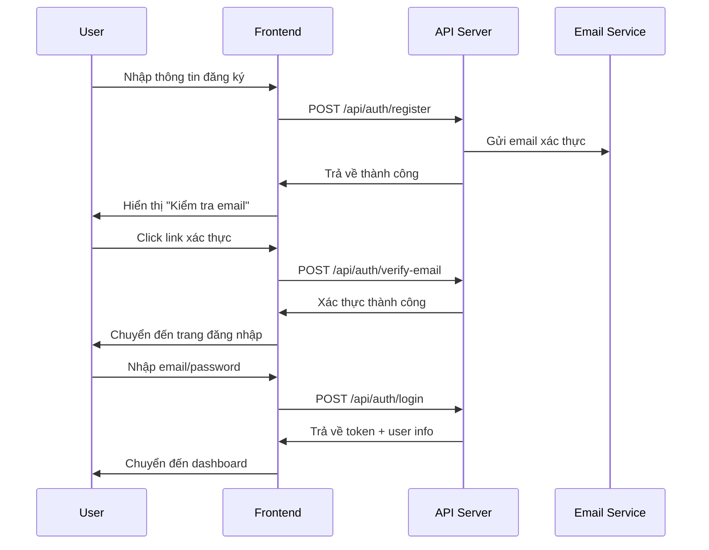
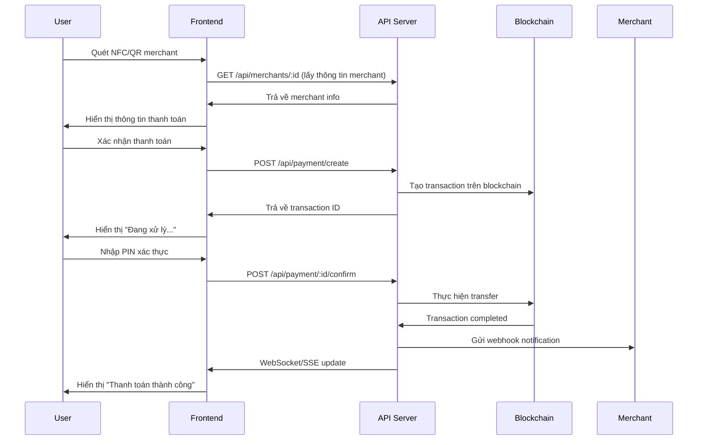

# USER API REPORT - NFC PAYMENT SYSTEM
## Báo cáo API cho vai trò User (Người dùng)

---

## 📱 TỔNG QUAN USER ROLE
**Vai trò:** Người dùng cuối sử dụng thẻ NFC để thanh toán
**Mục tiêu:** Quản lý thẻ, thực hiện thanh toán, theo dõi giao dịch

---

## 🔐 1. XÁC THỰC & ĐĂNG KÝ (Authentication)

### 1.1. Đăng ký tài khoản
```http
POST /api/auth/register
Content-Type: application/json

{
  "email": "user@example.com",
  "password": "User123!",
  "phoneNumber": "0123456789",
  "fullName": "Nguyen Van A"
}
```

**Response:**
```json
{
  "success": true,
  "message": "Registration successful. Please verify your email.",
  "user": {
    "id": "64a1b2c3d4e5f6789",
    "email": "user@example.com",
    "fullName": "Nguyen Van A",
    "status": "active"
  }
}
```

### 1.2. Đăng nhập
```http
POST /api/auth/login
Content-Type: application/json

{
  "email": "user@example.com",
  "password": "User123!"
}
```

**Response:**
```json
{
  "success": true,
  "tokens": {
    "accessToken": "eyJhbGciOiJIUzI1NiIs...",
    "refreshToken": "eyJhbGciOiJIUzI1NiIs..."
  },
  "user": {
    "id": "64a1b2c3d4e5f6789",
    "email": "user@example.com",
    "fullName": "Nguyen Van A",
    "role": "user"
  }
}
```

### 1.3. Xác thực email
```http
POST /api/auth/verify-email
Content-Type: application/json

{
  "token": "verification_token_from_email"
}
```

---

## 💳 2. QUẢN LÝ THẺ NFC (Card Management)

### 2.1. Lấy danh sách thẻ
```http
GET /api/cards
Authorization: Bearer {accessToken}
```

**Response:**
```json
{
  "success": true,
  "data": [
    {
      "id": "64a1b2c3d4e5f6789",
      "cardUuid": "550e8400-e29b-41d4-a716-446655440000",
      "cardType": "standard",
      "isActive": true,
      "isPrimary": true,
      "dailyLimit": 2000000,
      "monthlyLimit": 50000000,
      "dailySpent": 150000,
      "monthlySpent": 2500000,
      "lastUsed": "2025-01-15T10:30:00Z",
      "expiryDate": "2026-01-15T00:00:00Z"
    }
  ]
}
```

### 2.2. Tạo thẻ mới
```http
POST /api/cards
Authorization: Bearer {accessToken}
Content-Type: application/json

{
  "cardType": "standard",
  "dailyLimit": 2000000,
  "monthlyLimit": 50000000
}
```

### 2.3. Cập nhật thông tin thẻ
```http
PUT /api/cards/:cardId
Authorization: Bearer {accessToken}
Content-Type: application/json

{
  "dailyLimit": 3000000,
  "monthlyLimit": 60000000
}
```

### 2.4. Khóa/Mở khóa thẻ
```http
POST /api/cards/:cardId/toggle-status
Authorization: Bearer {accessToken}
Content-Type: application/json

{
  "reason": "User request"
}
```

---

## 💰 3. THANH TOÁN (Payment)

### 3.1. Tạo giao dịch thanh toán
```http
POST /api/payment/create
Authorization: Bearer {accessToken}
Content-Type: application/json

{
  "cardUuid": "550e8400-e29b-41d4-a716-446655440000",
  "merchantId": "mch_1234567890abcdef",
  "amount": 50000,
  "currency": "SUI",
  "description": "Coffee purchase"
}
```

**Response:**
```json
{
  "success": true,
  "data": {
    "transactionId": "64a1b2c3d4e5f6789",
    "status": "pending",
    "amount": 50000,
    "gasFee": 1000,
    "totalAmount": 51000,
    "estimatedTime": "2-5 seconds"
  }
}
```

### 3.2. Xác nhận thanh toán (PIN hoặc Biometric)
```http
POST /api/payment/:transactionId/confirm
Authorization: Bearer {accessToken}
Content-Type: application/json

{
  "pin": "1234",
  "biometricData": "optional_biometric_hash"
}
```

### 3.3. Kiểm tra trạng thái thanh toán
```http
GET /api/payment/:transactionId/status
Authorization: Bearer {accessToken}
```

**Response:**
```json
{
  "success": true,
  "data": {
    "transactionId": "64a1b2c3d4e5f6789",
    "status": "completed",
    "txHash": "0x1a2b3c4d5e6f7890...",
    "completedAt": "2025-01-15T10:35:00Z",
    "processingTime": 3500
  }
}
```

---

## 📊 4. LỊCH SỬ GIAO DỊCH (Transaction History)

### 4.1. Lấy lịch sử giao dịch
```http
GET /api/transactions?page=1&limit=20&type=payment&status=completed
Authorization: Bearer {accessToken}
```

**Response:**
```json
{
  "success": true,
  "data": {
    "transactions": [
      {
        "id": "64a1b2c3d4e5f6789",
        "type": "payment",
        "amount": 50000,
        "currency": "SUI",
        "status": "completed",
        "merchantName": "Coffee Shop ABC",
        "description": "Coffee purchase",
        "txHash": "0x1a2b3c4d5e6f7890...",
        "createdAt": "2025-01-15T10:30:00Z",
        "completedAt": "2025-01-15T10:35:00Z"
      }
    ],
    "pagination": {
      "total": 150,
      "pages": 8,
      "currentPage": 1,
      "limit": 20
    }
  }
}
```

### 4.2. Chi tiết giao dịch
```http
GET /api/transactions/:transactionId
Authorization: Bearer {accessToken}
```

---

## 👤 5. QUẢN LÝ TÀI KHOẢN (Profile Management)

### 5.1. Lấy thông tin cá nhân
```http
GET /api/profile
Authorization: Bearer {accessToken}
```

**Response:**
```json
{
  "success": true,
  "data": {
    "id": "64a1b2c3d4e5f6789",
    "email": "user@example.com",
    "fullName": "Nguyen Van A",
    "phoneNumber": "0123456789",
    "status": "active",
    "kycStatus": "verified",
    "dailyLimit": 5000000,
    "monthlyLimit": 100000000,
    "twoFactorEnabled": false,
    "createdAt": "2025-01-01T00:00:00Z"
  }
}
```

### 5.2. Cập nhật thông tin
```http
PUT /api/profile
Authorization: Bearer {accessToken}
Content-Type: application/json

{
  "fullName": "Nguyen Van B",
  "phoneNumber": "0987654321"
}
```

### 5.3. Đổi mật khẩu
```http
POST /api/auth/change-password
Authorization: Bearer {accessToken}
Content-Type: application/json

{
  "currentPassword": "OldPassword123!",
  "newPassword": "NewPassword456!"
}
```

---

## 🔐 6. BẢO MẬT 2FA (Two-Factor Authentication)

### 6.1. Kích hoạt 2FA
```http
POST /api/auth/enable-2fa
Authorization: Bearer {accessToken}
```

**Response:**
```json
{
  "success": true,
  "data": {
    "qrCode": "data:image/png;base64,iVBORw0KGgoAAAANSUhEUgAA...",
    "secret": "JBSWY3DPEHPK3PXP",
    "backupCodes": ["12345678", "87654321"]
  }
}
```

### 6.2. Xác thực 2FA
```http
POST /api/auth/verify-2fa
Authorization: Bearer {accessToken}
Content-Type: application/json

{
  "token": "123456"
}
```

---

## 📱 7. QUY TRÌNH SỬ DỤNG CHO FRONTEND

### 7.1. Quy trình đăng ký & đăng nhập


### 7.2. Quy trình thanh toán NFC


---

## 🎨 8. GỢI Ý THIẾT KẾ FRONTEND

### 8.1. Trang chính (Dashboard)
- **Header:** Logo, tên user, notification bell, profile menu
- **Balance Card:** Hiển thị số dư, daily/monthly limit progress
- **Quick Actions:** Scan QR, Send money, Top up, History
- **Recent Transactions:** 5 giao dịch gần nhất với status icons

### 8.2. Trang quản lý thẻ
- **Card List:** Hiển thị dạng card visual với status
- **Card Details:** Khi click vào card, show popup với limits, usage
- **Add Card:** Wizard tạo thẻ mới với các options
- **Card Settings:** Enable/disable, change limits, view usage

### 8.3. Trang thanh toán
- **Scanner:** Camera view để scan QR code
- **Payment Form:** Amount input, merchant info, payment method
- **Confirmation:** PIN pad hoặc biometric prompt
- **Result:** Success/failed animation với transaction details

### 8.4. Lịch sử giao dịch
- **Filter Bar:** Date range, type, status, amount filters
- **Transaction List:** Infinite scroll với lazy loading
- **Transaction Detail:** Modal với đầy đủ thông tin + receipt

---

## ⚠️ 9. XỬ LÝ LỖI & TRẠNG THÁI

### 9.1. Error Codes cần handle
- `AUTH_001`: Token expired → Redirect to login
- `AUTH_002`: Invalid credentials → Show error message
- `CARD_001`: Card blocked → Show unblock option
- `PAYMENT_001`: Insufficient balance → Show top-up option
- `PAYMENT_002`: Transaction failed → Show retry option

### 9.2. Loading States
- **Authentication:** Spinner với "Đang đăng nhập..."
- **Payment:** Progress bar với estimated time
- **Transaction List:** Skeleton loading cho danh sách
- **Card Actions:** Disabled state với loading indicator

---

## 🔄 10. REAL-TIME UPDATES

### WebSocket Events cho User:
```javascript
// Kết nối WebSocket
const ws = new WebSocket('ws://localhost:8080');

// Lắng nghe events
ws.on('transaction_status_update', (data) => {
  // Update UI khi trạng thái giao dịch thay đổi
  updateTransactionStatus(data.transactionId, data.status);
});

ws.on('card_status_change', (data) => {
  // Update UI khi thẻ bị khóa/mở
  updateCardStatus(data.cardId, data.status);
});

ws.on('balance_update', (data) => {
  // Update số dư real-time
  updateBalance(data.newBalance);
});
```

---

## 📋 11. CHECKLIST PHÁT TRIỂN

### Phase 1 - Cơ bản:
- [ ] Authentication flow (register, login, logout)
- [ ] Profile management
- [ ] Card listing và basic management
- [ ] Transaction history với pagination

### Phase 2 - Thanh toán:
- [ ] QR/NFC scanner
- [ ] Payment flow với confirmation
- [ ] Real-time transaction status
- [ ] Receipt generation

### Phase 3 - Nâng cao:
- [ ] 2FA integration
- [ ] Push notifications
- [ ] Biometric authentication
- [ ] Offline mode support

### Phase 4 - Tối ưu:
- [ ] Performance optimization
- [ ] Error handling & retry logic
- [ ] Accessibility features
- [ ] Testing coverage

---

*Báo cáo này cung cấp đầy đủ thông tin API và quy trình để phát triển frontend cho user role trong hệ thống NFC Payment.*